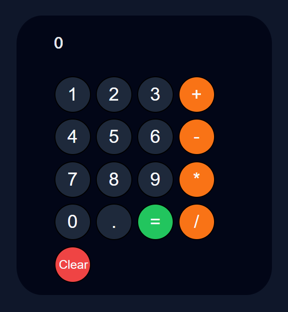

# Simple Calculator

A clean, responsive calculator with a dark theme built using HTML, CSS, and vanilla JavaScript.

 
## ✨ Features

- **Basic Operations:** Addition, subtraction, multiplication, and division.
- **Decimal Support:** Handles floating-point calculations.
- **Error Handling:** Detects invalid inputs and displays a friendly error message.
- **Clear Function:** Instantly resets the calculator.
- **Dark Mode UI:** Designed with a modern slate color palette.

## 🚀 How to Use

1. **Clone the repository:**
   ```bash
   git clone [https://github.com/akshaysangaraju/javascript-calculator.git](https://github.com/akshaysangaraju/javascript-calculator.git)
